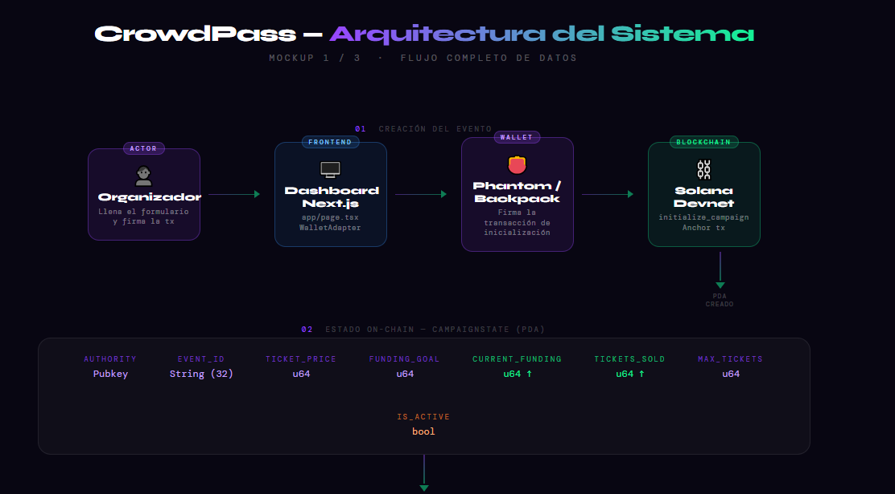
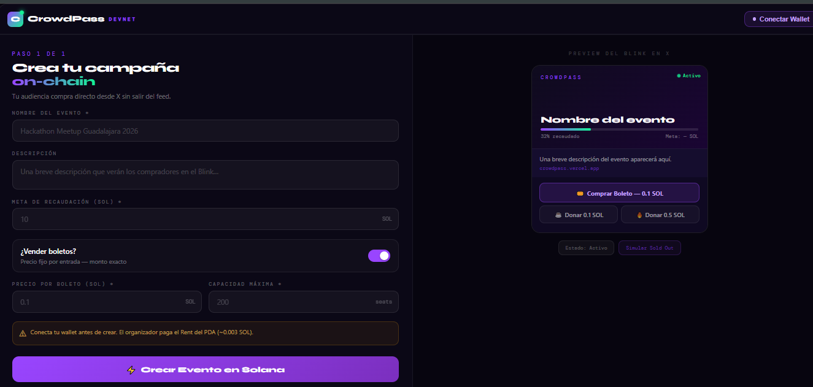
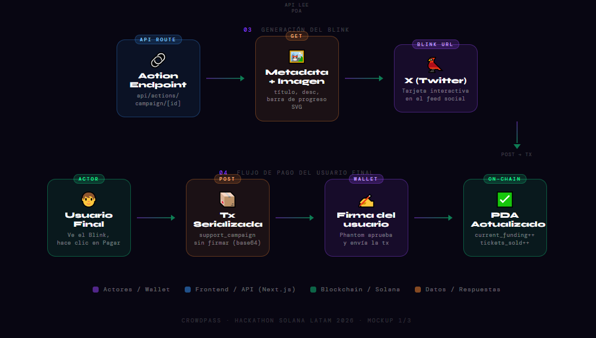

# 🎟️ CrowdPass — Solana LATAM Hackathon 2026

CrowdPass convierte el feed de X (Twitter) en una taquilla de ventas directa y on-chain utilizando **Solana Actions & Blinks**. La plataforma permite a los creadores lanzar campañas, vender boletos o recibir apoyo económico sin sacar al usuario del flujo social, mientras el estado del evento queda asegurado en Solana.

---

## 🚀 Proyecto en Vivo

- **Aplicación Frontend:** [https://crowdpass-solana.vercel.app](https://crowdpass-solana.vercel.app)
- **Ejemplo en Blink:** Pega este enlace en [Dial.to](https://dial.to) o en X (Twitter):
  `https://crowdpass-solana.vercel.app/api/actions/campaign/TU_BILLETERA_AQUI_EL_ID_DE_TU_EVENTO`

---

## 🏗️ Arquitectura del Sistema

El flujo de CrowdPass conecta al organizador directamente con el usuario final sin redirecciones, asegurando el estado mediante un PDA (`CampaignState`) y una API de Actions construida en Next.js.

<p align="center">
  
</p>

Mockups relacionados:

- [`frontend/public/mockups/mockups-index.html`](frontend/public/mockups/mockups-index.html)

---

## 🖥️ Dashboard del Organizador

El organizador configura el evento desde una interfaz en Next.js donde define nombre, descripción, meta de recaudación, precio del boleto y capacidad máxima. Al mismo tiempo puede previsualizar cómo se verá el Blink antes de publicarlo.

<p align="center">
  
</p>

Mockup HTML:

- [`frontend/public/mockups/mockup-02-dashboard.html`](frontend/public/mockups/mockup-02-dashboard.html)

---

## 🐦 Flujo del Blink en X

Una vez publicada la campaña, el Blink consulta el estado on-chain, genera metadata dinámica y permite que el usuario firme la transacción directamente desde la experiencia social.

<p align="center">
  
</p>

Mockup HTML:

- [`frontend/public/mockups/mockup-03-blink-states.html`](frontend/public/mockups/mockup-03-blink-states.html)

---

## 🎨 Mockups e Interacción

Si quieres ver los mockups originales en alta resolución:

1. Clona este repositorio.
2. Abre los archivos de [`frontend/public/mockups/`](frontend/public/mockups/).

Archivos principales:

- [`frontend/public/mockups/mockup-02-dashboard.html`](frontend/public/mockups/mockup-02-dashboard.html)
- [`frontend/public/mockups/mockup-03-blink-states.html`](frontend/public/mockups/mockup-03-blink-states.html)
- [`frontend/public/mockups/mockups-index.html`](frontend/public/mockups/mockups-index.html)

---

## 🏛️ Arquitectura y Tecnologías

- **Blockchain:** Solana Devnet
- **Smart Contract:** Rust + Anchor en [`backend/`](backend/)
- **Frontend:** Next.js 14 (App Router) + React + Tailwind CSS en [`frontend/`](frontend/)
- **Wallets:** `@solana/wallet-adapter-react`
- **Blinks / Actions:** `@solana/actions`

---

## 💻 Configuración Local

### 1. Requisitos previos

Instala lo siguiente:

1. Node.js y npm (v18 o superior)
2. Rust y Cargo
3. Solana CLI
4. Anchor CLI

Si usas Linux o Mac, puedes automatizar gran parte del proceso con:

```bash
bash local-setup.sh
```

### 2. Levantar el backend

```bash
cd backend
npm install
anchor build
anchor keys sync
anchor deploy
```

Después de desplegar, copia el nuevo Program ID y actualiza:

- `frontend/.env.local`
- `backend/programs/crowd_pass/src/lib.rs`
- `backend/Anchor.toml`

### 3. Configurar el frontend

```bash
cd frontend
npm install
```

Copia `frontend/.env.example` a `frontend/.env.local` y ajusta tu configuración:

```env
# Opcional si vas a usar el Program ID demo que ya viene como fallback en el codigo.
# NEXT_PUBLIC_PROGRAM_ID=EL_PROGRAM_ID_QUE_TE_DIO_ANCHOR
NEXT_PUBLIC_RPC_URL=https://api.devnet.solana.com
NEXT_PUBLIC_BASE_URL=http://localhost:3000
NEXT_PUBLIC_APP_URL=http://localhost:3000
```

Si vas a probar Blinks fuera de localhost, cambia `NEXT_PUBLIC_BASE_URL` y `NEXT_PUBLIC_APP_URL` por tu URL pública. Si desplegaste tu propio contrato, define también `NEXT_PUBLIC_PROGRAM_ID`.

### 4. Ejecutar la app

```bash
cd frontend
npm run dev
```

Abre [http://localhost:3000](http://localhost:3000) para probar la DApp.

---

## 📖 Funcionalidades Principales

1. Creación de campañas on-chain con meta de recaudación, precio y límite de boletos.
2. Estado inmutable usando PDAs en Solana para guardar fondos, capacidad y progreso.
3. Blinks dinámicos que reflejan en tiempo real si la campaña sigue activa, si ya alcanzó su meta o si se agotaron los boletos.
4. Flujo de compra o apoyo sin redirecciones, con firma desde la wallet del usuario.

---

## 🤝 Contribuciones

Toda aportación es bienvenida. Si encuentras un bug o una mejora, abre un issue o propón un cambio.

---

Hecho para el ecosistema global de constructores y hackers de Solana.
